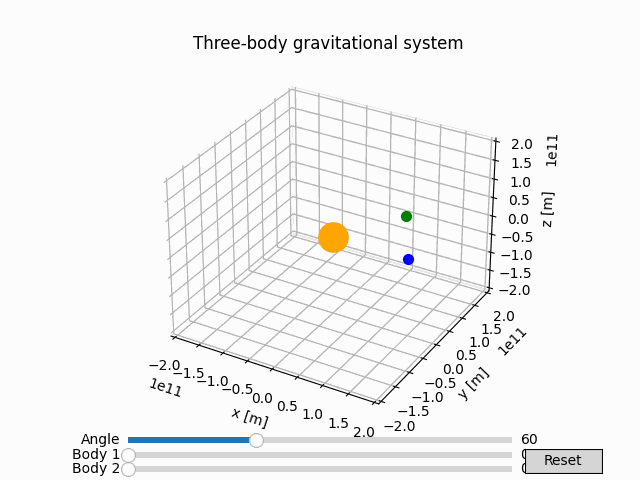

# Lagrange coorbital systems

A repository of algorithms exploring **coorbital dynamics and Lagrange point configurations** in planetary systems.

The following algorithms are available:
- [lagrange_dynamics](./lagrange_dynamics)

This algorithm was developed in a single afternoon as a response to questions raised by our students about possible stable configurations for planets sharing the same orbit, across a wide range of mass ratios.

## Lagrange dynamics 

An **object-oriented program for simulating coorbital dynamics** of bodies orbiting a massive celestial body. It provides a model for orbital dynamics and the analysis of different planetary configurations.

### ⚙️ Features

- **Orbital dynamics**: numerical integration of the gravitational 3-body problem.
- **Coorbital configurations**: analysis of bodies in different relative orbital configurations, including Lagrange points.
- **Animation and analysis**: 3D animation and visualization of orbital motion. 
- **Software structure**: object-oriented architeture with independent classes and configuration file.

### 🎞️ Animation

- Coorbital animation with the secondary body initially positioned at the L4 point:
